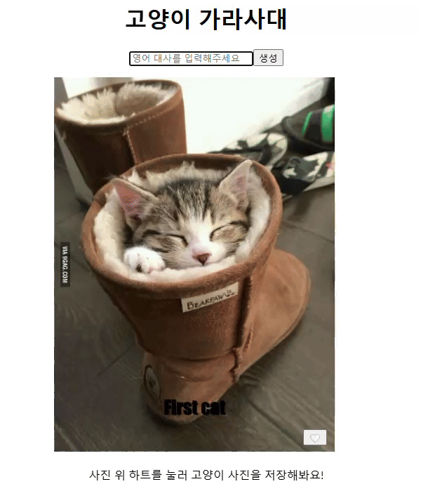

# 📝Project : cat-jjal-maker

### 고양이 짤 메이커

> 랜덤으로 보여주는 귀여운 고양이 사진에 내가 원하는 영문 문구를 추가하여 짤로 만들어주는 페이지

React 복습을 위해 인프런 강의(https://www.inflearn.com/course/%EB%A7%8C%EB%93%A4%EB%A9%B4%EC%84%9C-%EB%B0%B0%EC%9A%B0%EB%8A%94-%EB%A6%AC%EC%95%A1%ED%8A%B8-%EA%B8%B0%EC%B4%88) 를 수강하며 제작된 페이지 입니다.

## 기능

- 랜덤 고양이 사진 확인 가능
- 문구 입력시 유효성 검사 진행
- 영문으로 문구를 작성 후 생성 버튼 클릭 시 고양이 사진 하단에 문구가 작성된 짤 확인 가능
- 스크랩 버튼 클릭된 사진들은 하단에 모아서 확인 가능
-

## 추후 구현 예정

- 생성된 고양이 짤 사진 저장하기, 공유하기 기능 추가
- 스크랩된 화면 UI 수정 및 기능 추가 디벨롭

## 배포 URL

https://jini0012.github.io/cat-jjal-maker/

## 사용 언어

## 화면

|        📝        |                                      Cat jjal Maker                                       |
| :--------------: | :---------------------------------------------------------------------------------------: |
|    기본 화면     |  |
|                  |
| 문구 유효성 검사 |                                                     |
|                  |
| 이미지 생성 기능 |                                                     |
|   스크랩 기능    |                                                     |
|  생성된 짤 예시  |  |
